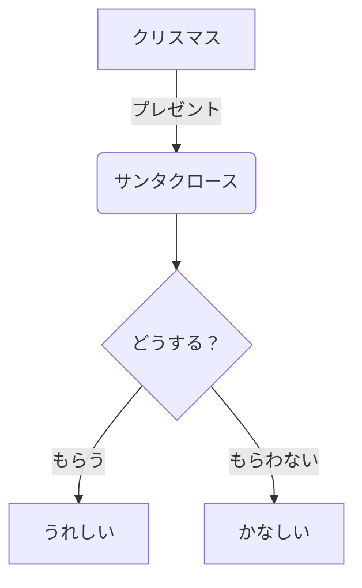
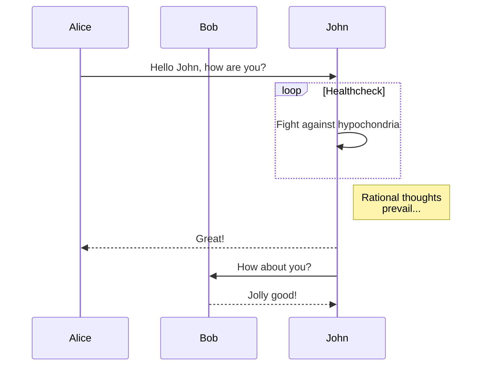
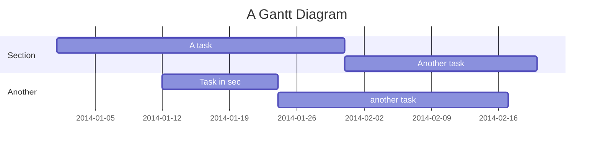

### マークダウン記法とは？

マークダウン（Markdown）は、文章を構造化し、見た目を整えるためのシンプルな記述方法（軽量マークアップ言語）です。普段使っているテキストエディタで、簡単に見出しや箇条書き、リンクなどを含む整った文章を作成できます。

書いた文章は、HTMLやPDFなど、さまざまな形式に変換することが可能です。

### なぜマークダウンを使うのか？

*   **習得が簡単**：覚えるべきルールが少なく、誰でもすぐに使い始められます。
*   **読みやすい・書きやすい**：記号がシンプルなので、書いたそのままの状態でも文章の構造が分かりやすく、読みやすいです。
*   **特定のソフトに依存しない**：ただのテキストファイルなので、メモ帳から専門のコードエディタまで、どんなエディタでも作成・編集できます。
*   **再利用性が高い**：HTMLに簡単に変換できるため、ウェブサイトの記事作成、技術ドキュメント、日々のメモ、READMEファイルなど、幅広い用途で利用されています。

### 基本的な書き方

#### 1. 見出し (Headings)

行頭に `#`（ハッシュ）を置きます。`#`の数が見出しのレベルに対応します（HTMLの`<h1>`〜`<h6>`に相当）。

```markdown
# 見出し1
## 見出し2
### 見出し3
```

#### 2. 段落と改行 (Paragraphs and Line Breaks)

文章の塊（段落）は、1行以上の空行で区切ります。
文章の途中で改行したい場合は、行末にスペースを2つ以上入力します。

```markdown
これは最初の段落です。

これは次の段落です。

この行の最後で  
改行します。
```

#### 3. 強調 (Emphasis)

*   **太字**: `**テキスト**` または `__テキスト__`
*   *斜体*: `*テキスト*` または `_テキスト_`
*   ***太字と斜体***: `***テキスト***`

```markdown
これは **太字** です。
これは *斜体* です。
```

#### 4. 箇条書きリスト (Lists)

行頭に `-`（ハイフン）、`*`（アスタリスク）、`+`（プラス）のいずれかを置きます。

```markdown
- りんご
- ばなな
  - 黄色いばなな
- みかん
```

番号付きリストの場合は、数字とピリオドを使います。

```markdown
1. 最初の項目
2. 2番目の項目
3. 3番目の項目
```

#### 5. 引用 (Blockquotes)

行頭に `>`（大なり記号）を置きます。

```markdown
> これは引用文です。
> アインシュタインは言いました...
```

#### 6. リンク (Links)

`[表示テキスト](URL)` の形式で記述します。

```markdown
[Google](https://www.google.com)
```

#### 7. 画像 (Images)

リンクの先頭に `!`（エクスクラメーションマーク）を付けます。

```markdown

```

#### 8. コード (Code)

*   **インラインコード**: バッククォート `` ` `` で囲みます。
*   **コードブロック**: 3つのバッククォート ` ``` ` で囲みます。言語名を指定すると、色付け（シンタックスハイライト）が有効になる場合があります。

```markdown
`print("Hello, World!")` のように使います。

```python
def hello():
    print("Hello, World!")
```
```

#### 9. 水平線 (Horizontal Rules)

`-` や `*` を3つ以上続けます。

```markdown
---
***
```

#### 10. 表 (Tables)

`|`（パイプ）と `-`（ハイフン）を組み合わせて作成します。

```markdown
| ヘッダー1 | ヘッダー2 |
| --------- | --------- |
| セル1-1   | セル1-2   |
| セル2-1   | セル2-2   |
```

---

マークダウンは非常に直感的で便利なため、エンジニアやライターだけでなく、多くの人にとって強力なツールとなります。ぜひ日々のメモやドキュメント作成で活用してみてください。

### マーメイド記法とは？

マーメイド（Mermaid）は、マークダウンのようなテキストベースの記法で、フローチャート、シーケンス図、ガントチャートなどの図を簡単に作成できるツールです。

マークダウンファイル内に埋め込むことができ、コードから図を自動的に生成してくれるため、図の作成や修正が非常に効率的になります。

### なぜマーメイドを使うのか？

*   **テキストベース**: バージョン管理システム（Gitなど）で変更履歴を管理できます。
*   **修正が容易**: 図形の位置をマウスで調整する必要がなく、テキストを修正するだけで図全体が更新されます。
*   **再利用性が高い**: 同じような図を何度も作成する場合、テンプレートとしてテキストをコピーして少し修正するだけで済みます。

### 基本的な書き方

マーメイド記法は、マークダウンのコードブロック記法の中に記述します。言語名として `mermaid` を指定します。


#### 1. フローチャート (Flowchart)



*   `graph TD` は上から下へのフローチャートを意味します。
*   `A[テキスト]` で四角形のノードを作成します。
*   `B(テキスト)` で角の丸いノードを作成します。
*   `C{テキスト}` でひし形のノードを作成します。
*   `-->` でノード間を矢印でつなぎます。
*   `|テキスト|` で矢印にラベルを追加できます。

#### 2. シーケンス図 (Sequence Diagram)



*   `sequenceDiagram` でシーケンス図を開始します。
*   `participant` で参加者を定義します。
*   `->>` で実線の矢印、`-->>` で破線の矢印のメッセージを表します。
*   `loop` や `note` などで処理のループやメモを追加できます。

#### 3. ガントチャート (Gantt Chart)



*   `gantt` でガントチャートを開始します。
*   `title` でチャートのタイトルを定義します。
*   `dateFormat` で日付のフォーマットを指定します。
*   `section` でタスクのセクションを区切ります。
*   タスク名、開始日（または前のタスクからの相対位置）、期間をコロンで区切って記述します。

---

このように、マーメイド記法を使えば、専門的な作図ツールを使わなくても、テキストだけで簡単に高品質な図を作成できます。ぜひ、ドキュメントやプレゼンテーションで活用してみてください。